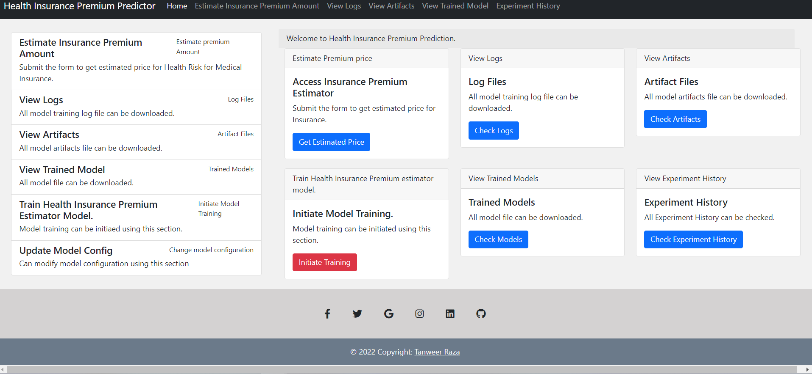
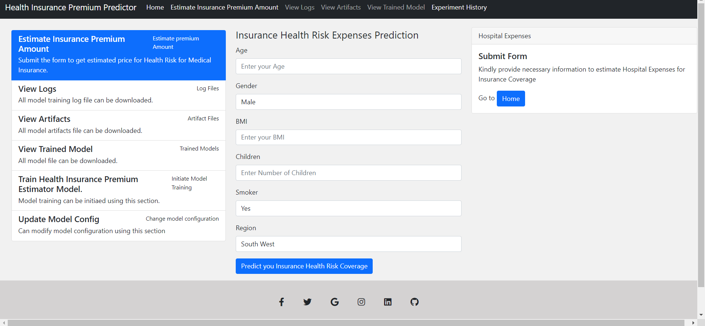
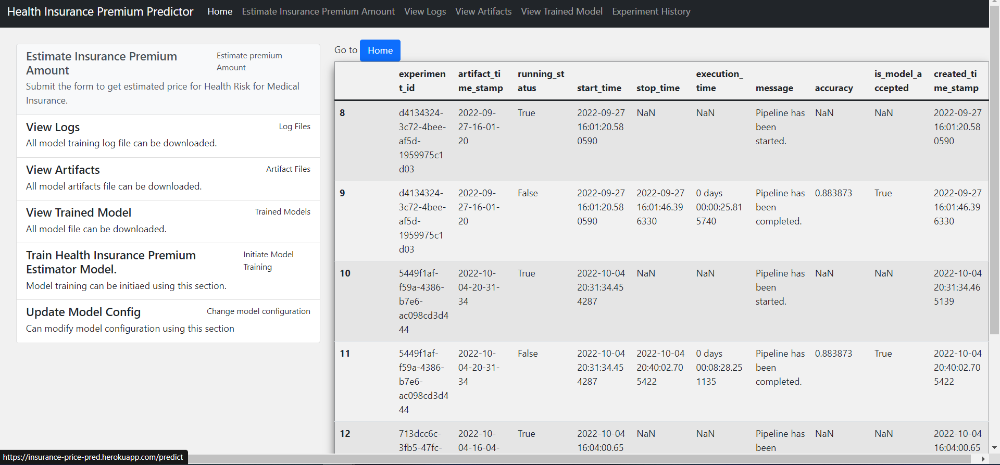
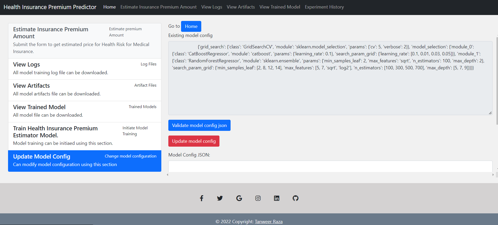
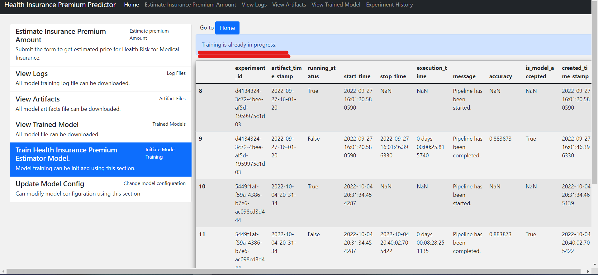

# Raza-Insurance_Price_prediction_ML_project_02

### Application deployment link :
[Insurance Premium predictor](https://insurance-price-pred.herokuapp.com/)

### Language and Libraries

<p>
<a></a>
<a></a>
<a></a>
 <a></a>
<a></a>
<a></a>
</p>


### Software and account requirements. 

1. [Github Account](https://github.com)
2. [Heroku Account](https://dashboard.heroku.com/login)
3. [VS Code IDE](https://code.visualstudio.com/download)
4. [GIT cli](https://git-scm.com/downloads)
5. [GIT Documentation](https://git-scm.com/docs/gittutorial)

# Insurance Premium Prediction ML Project 
**Life cycle of Machine learning Project**
```
* Understanding the Problem Statement
* Data Collection & understanding
* Exploratory data analysis
* Data Cleaning
* Data Pre-Processing
* Model Training 
* Choose best model
```

Starting with the project :

## Understanding the Problem Statement:
- The amount of the premium for a health insurance policy depends from person to person, as many factors affect the amount of the premium for a health insurance policy. Let’s say age, a young person is very less likely to have major health problems compared to an older person. Thus, treating an older person will be expensive compared to a young one. That is why an older person is required to pay a high premium compared to a young person.Just like age, many other factors affect the premium for a health insurance policy. Hope you now have understood what health insurance is and how the premium for a health insurance policy is determined. 

- The goal of this project is to give people an estimate of how much they need based on their individual health situation. After that, customers can work with any health insurance carrier and its plans and perks while keeping the projected cost from our study in mind. This can assist a person in concentrating on the health side of an insurance policy rather han the ineffective part.

## Data Collection & understanding :

The dataset is collected from the following link :
https://www.kaggle.com/datasets/noordeen/insurance-premium-prediction

The dataset that I am using for the task of health insurance premium prediction is collected from Kaggle.

- This dataset contains 1338 observations (rows) 
- 7 features (columns). 
- The dataset contains 4 numerical features and 3 nominal features.
- 1 target feature i.e expenses.


## Features in Datasets: :

1. `age` : int - the age of the person
2. `sex` : object - gender of the person
3. `bmi` : float - Body Mass Index of the person
4. `children` : int - how many children the person is having
5. `smoker` : object - whether the person smoke or not
6. `region` : object - the region where the person lives
7. `expenses` : float - the prememium amount of the insurance policy


numerical_columns :
  - age
  - bmi
  - children


categorical_columns:
  - sex
  - smoker
  - region
  
target_column : 
  - expenses  

domain_value :

    region:
      - southeast
      - northeast
      - northwest
      - southwest

    smoker :
      - yes
      - no

    sex :
    - male
    - female
    

## Starting with the project :

Creating Conda environment
```
conda create --prefix venv python==3.7 -y
```


Activating the virtual environment 
```
conda activate venv/
```  
OR
```
conda activate venv
```
Installing libraries or requirements.
```
pip install -r requirements.txt
```
Run Application
```
python app.py
```

## 🔧 Built with
- Python 3.7
- Flask
- Machine learning
- Scikit learn

## Models Used
* Linear Regression
* Ridge Regression
* Lasso Regression
* KNeighbors Regressor
* RandomForest Regressor
* DecisionTree Regressor  
* CatBoost Regressor
* XGB Regressor
* AdaBoost Regressor

From these above models after hyperparameter optimization we selected Top two models which were CatBoost Regressor and Random Forest Regressors and used the following in Pipeline.

* GridSearchCV is used for Hyperparameter Optimization in the pipeline.

* Any modification has to be done in  Inside Config.yaml 

## `insurance_premium` is the main package folder which contains. 

**Artifact** : Stores all artifacts created from running the application.

**Components** : Contains all components of Machine Learning Project
- DataIngestion
- DataValidation
- DataTransformations
- ModelTrainer
- ModelEvaluation
- ModelPusher

**Custom Exceptions and Logger** are used in this Project for better debugging purposes.

## 📷 Application Screenshots

### **This is the screenshot of the Home Webpage which has been done using the Flask**


### **This is the screenshot of the webpage which gets user input for prediction**


### **This is the screenshot of the page which shows history of the experiment that had run previously and currently running status**
#### Can be used as experiment history Tracking


### **This is the screenshot of the page in which user can change the model parameters for the experiment**


### **This is the screenshot of the page in which user can train the model with update new parameters in Update Model Config section**


## Conclusion

This Project which predicts the amount of the insurance premium based on different parameters (like Age,BMI etc) for a particular person can be implemented practically and used by Insurance Comapnies in real life. This will help the 
companies to predict the estimate for Insurance premium for a particular person by considering the risk involved for that particular person. 


